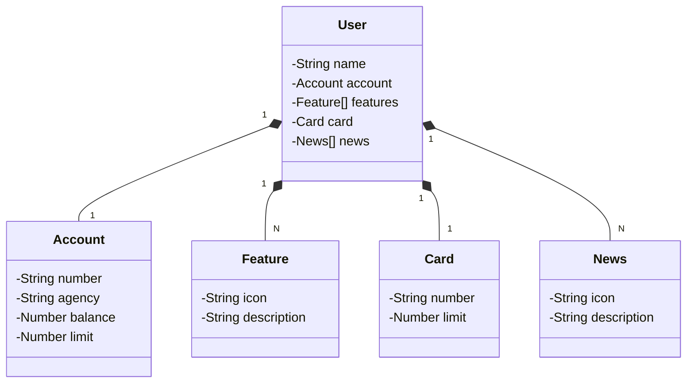

Digital Innovation One
 
 
## :octocat: Sobre mim
Meu nome é **Gilberto Ferrari** 
Sou um iniciante em programação e estou atualmente realizando uma trilha de aprendizado, com o foco em desenvolvimento **back-end** usando a linguagem **Java**  
# Java RESTful API  
## Diagrama de Classes (Domínio da API)

